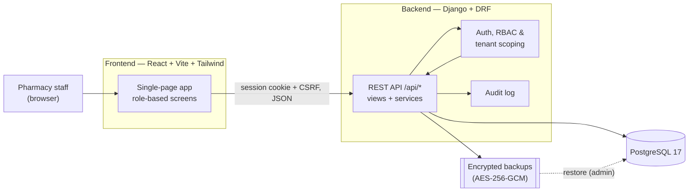
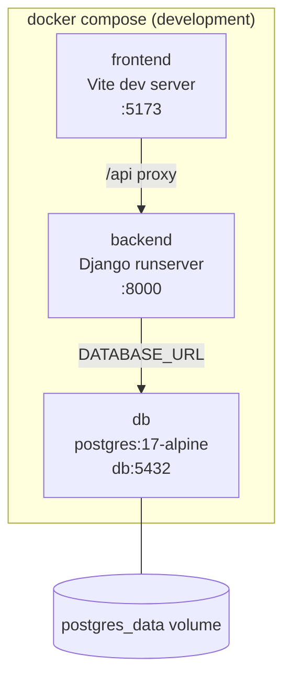
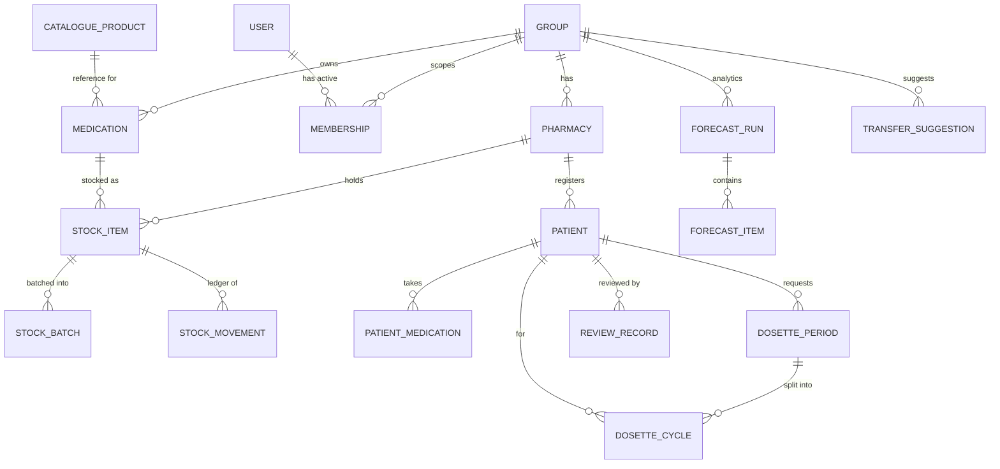
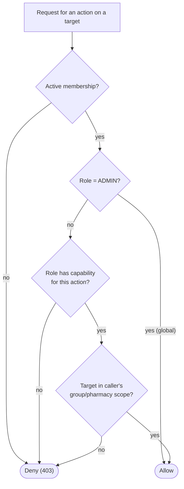
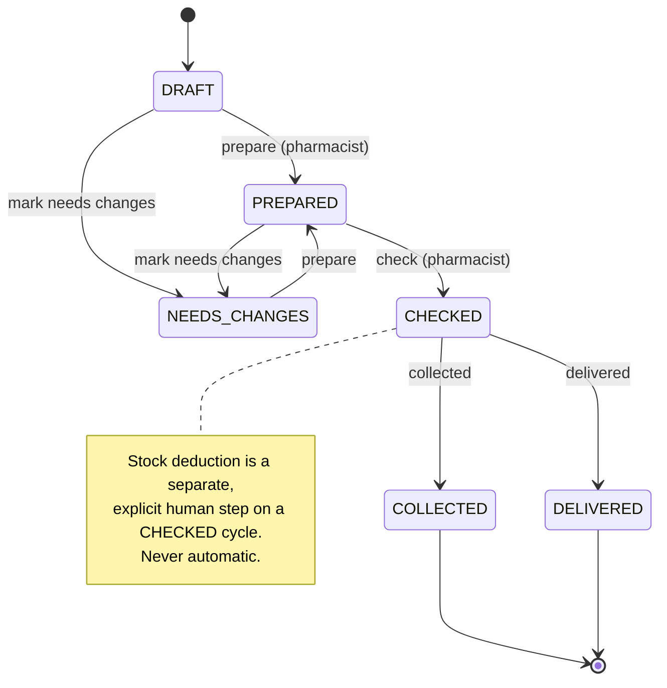
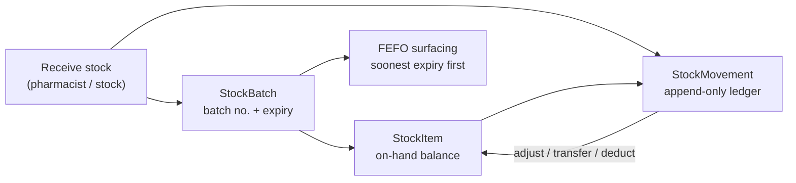
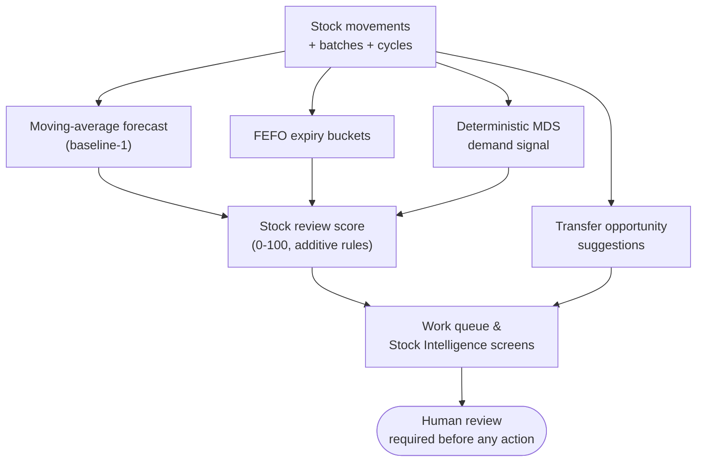
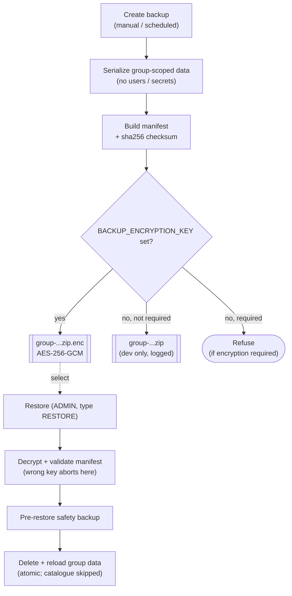
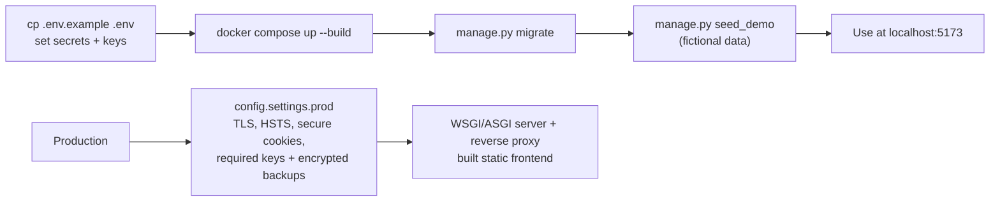

# Diagrams

Visual overviews of AI Pharmacy Manager, rendered with Mermaid. These reflect the
implemented system; for detail see [PROJECT_MAP.md](PROJECT_MAP.md),
[DATABASE_SCHEMA.md](DATABASE_SCHEMA.md), and
[FORECASTING_AND_INTELLIGENCE.md](FORECASTING_AND_INTELLIGENCE.md).

## System architecture

## Container diagram (Docker Compose)

## Entity-relationship overview

Patient identity fields and note bodies are stored **encrypted at rest**; see
[SECURITY_AND_DATA_PROTECTION.md](SECURITY_AND_DATA_PROTECTION.md).

## Role / scope access flow

## MDS / dosette workflow

## Stock receive / batch / movement flow

## Stock intelligence flow (read-only signals)

Nothing here orders, transfers, or dispenses automatically.

## Backup and restore flow

## Deployment flow

See [DEPLOYMENT.md](DEPLOYMENT.md) for the production checklist.
