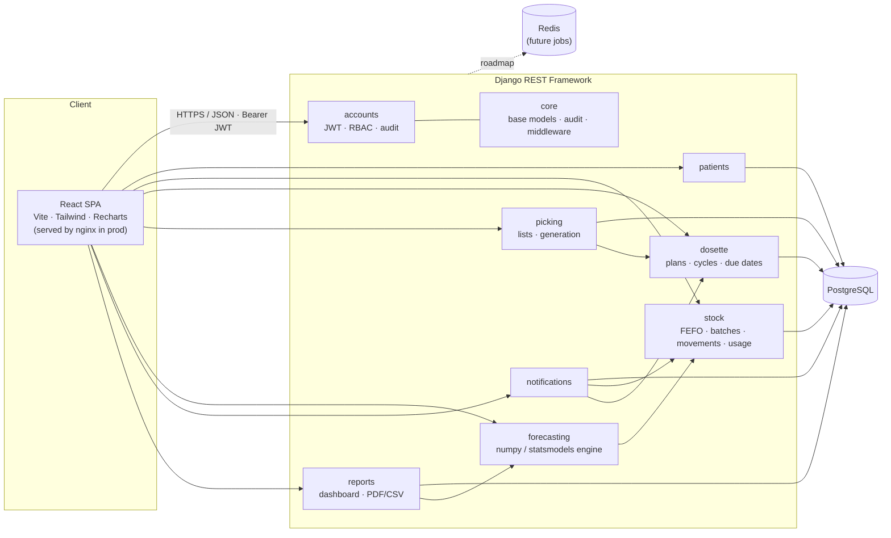
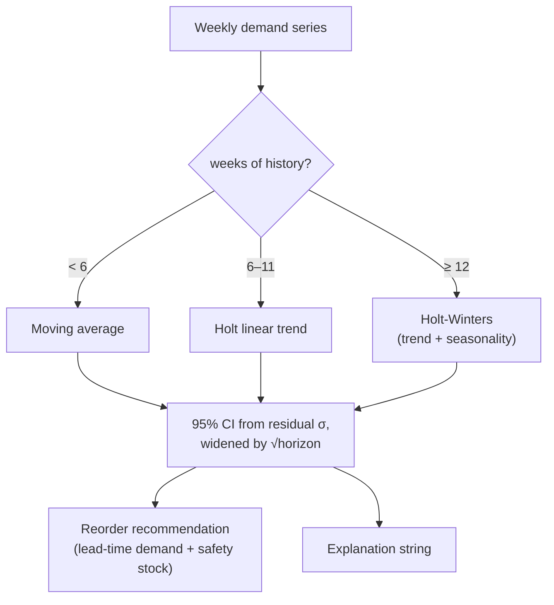

# Architecture

## Overview

Pharmacy Manager is a **decoupled single-page application + REST API**. The React SPA owns all
presentation and client-side routing; the Django REST Framework API owns business logic, data
integrity, authentication and the forecasting engine. They communicate over JSON with stateless
JWT authentication, which keeps the API horizontally scalable and lets the frontend be served as
static assets from a CDN/nginx.



## Layered design (backend)

Each domain app follows the same vertical slice so the codebase is predictable:

```
models.py        →  data + invariants (e.g. FEFO ordering, cycle generation)
services.py      →  cross-model business operations (FEFO allocation, picking generation,
                    notification scanning) kept out of views for testability
serializers.py   →  API representation & validation
views.py         →  thin DRF ViewSets/APIViews wiring permissions + serializers + services
permissions.py   →  (core) reusable RBAC gates
urls.py          →  router registration
```

**Why services are separate from views:** business rules (FEFO allocation, forecasting, cycle
generation) are pure and unit-testable without HTTP, and are reused by management commands (seed),
the notification scanner and the reporting layer.

## Authentication & RBAC

- Login (`/api/auth/login/`) returns an **access** token (30 min) and a **refresh** token (1 day);
  the role is embedded as a JWT claim.
- The SPA stores tokens and transparently refreshes on `401` via a single-flight interceptor
  (`frontend/src/api/client.js`).
- Authorisation is centralised in `apps/core/permissions.py`. `RolePermission` reads `allowed_roles`
  (write) and `read_roles` (safe methods) off each ViewSet; administrators bypass all gates.
  Safety-critical actions (pack **final check**) use the stricter `IsPharmacistOrAdmin`.

## Audit logging

`CurrentUserMiddleware` stashes the request user in thread-local storage so `apps.core.audit.record()`
can attribute an actor from anywhere — including service-layer calls that don't receive the request.
Audit entries snapshot the actor label so the trail survives user deletion.

## Forecasting

`apps/forecasting/engine.py` builds a contiguous, zero-filled **weekly** demand series from
`stock.MedicineUsage`, then selects a method by data volume:



statsmodels is optional: if import or fitting fails, the engine falls back to a NumPy
least-squares trend so the API never hard-fails.

## Frontend composition

```
main.jsx → BrowserRouter → AuthProvider → ToastProvider → App
App.jsx  → <Protected> route guard → Layout (sidebar + topbar) → page Outlet
pages/*  → use useFetch() for loading/empty/error/success states
components/ui.jsx → house vocabulary: Button, Card, StatusChip, Modal, Toast, Skeleton, inputs
components/DataTable.jsx → sortable, sticky-header, tabular-figure data tables
```

Every data-backed view renders all four states (loading skeletons, empty, error-with-retry,
populated), per the design-system requirement for a pro tool.

## Deployment topology

In production, `frontend` (nginx) serves the built SPA and reverse-proxies `/api/` to the
`backend` (gunicorn) service; `backend` talks to `db` (PostgreSQL). Redis is provisioned for the
roadmap's background-jobs work. See [`deployment.md`](deployment.md).
