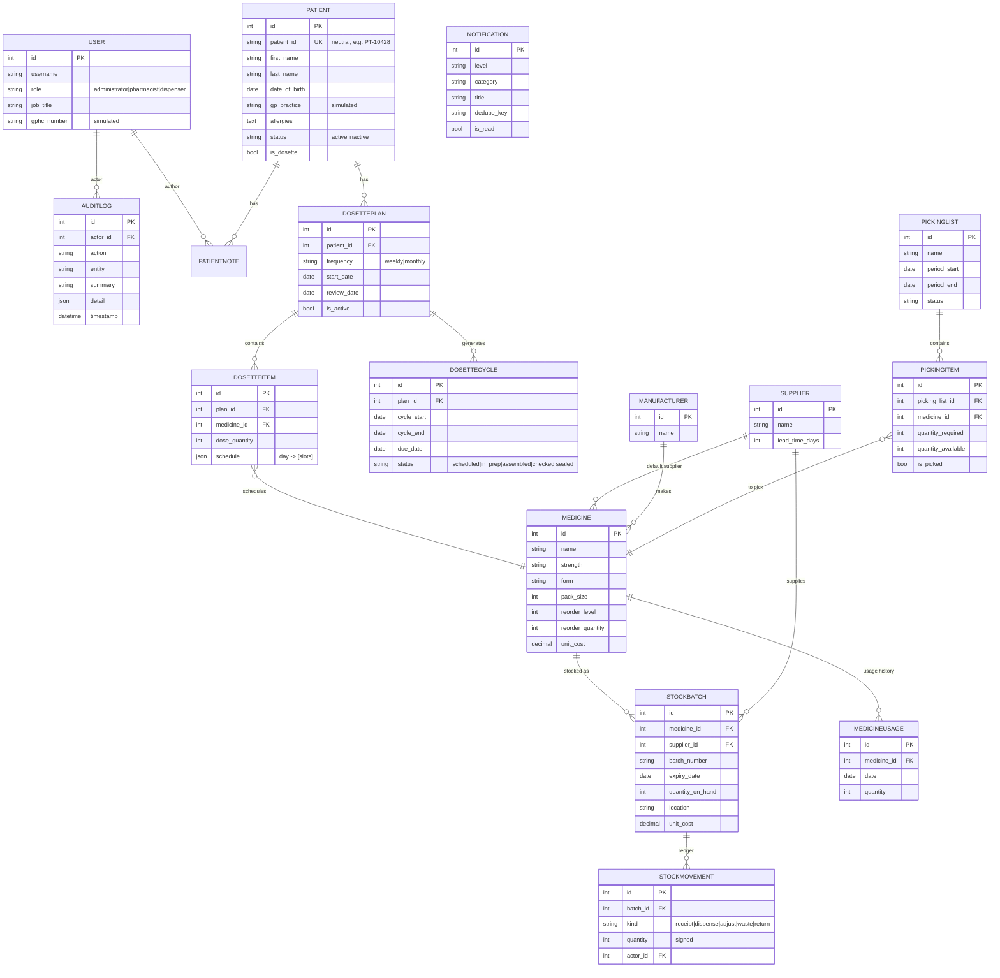

# Entity-Relationship Diagram & Data Model

## Design notes

- **No national health identifier.** Patients are keyed by a neutral internal `patient_id`. There is
  deliberately no field for, or integration with, any external healthcare identifier or service.
- **Batch is the FEFO unit.** Quantities live on `StockBatch` (not `Medicine`), so expiry, location
  and First-Expired-First-Out allocation are exact. `StockMovement` is an append-only ledger.
- **Schedule as JSON.** `DosetteItem.schedule` maps each day to its time-slots
  (`{"mon": ["morning","night"], …}`), which maps cleanly to the printed pack label and the UI grid
  without an explosion of rows.
- **Usage time series.** `MedicineUsage` (one row per medicine per day) is the forecasting input,
  decoupled from the movement ledger so history can be seeded and queried efficiently.
- **Idempotent notifications.** `dedupe_key` lets the scanner upsert one alert per logical condition.
